[github.com/shashank-fq](https://github.com/shashank-fq) &nbsp;·&nbsp;
[instagram](https://www.instagram.com/shashank.fq/) &nbsp;·&nbsp;
[linkedin](https://www.linkedin.com/in/shashank-shankar-a18a5431a/) &nbsp;·&nbsp;
[email](mailto:shashank.fq@gmail.com)

> CS student at Bangalore Institute of Technology. 
> Building useful things while finding my way through software.

I am learning by building, breaking, and improving small projects. 

<samp>python &nbsp; C++ &nbsp; javascript &nbsp; sql &nbsp; mysql &nbsp; websockets &nbsp; fastapi &nbsp; postgres &nbsp; docker &nbsp; git &nbsp; alembic &nbsp; github actions &nbsp; java</samp>

Projects will be added here as I build and publish them.

